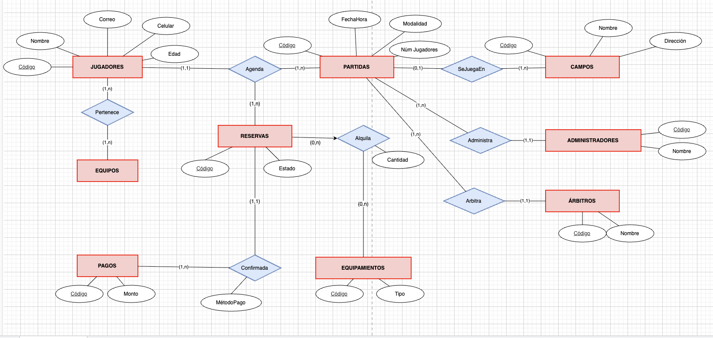

# 📄 Informe Técnico del Taller

## 🔖 Nombre del Taller
_Taller 2 - Modelo de Informacion y Diagrama Entidad-Relacion (ERD) - Caso: Gestion de un Campo de Airsoft_

## 👥 Integrantes del equipo
- Rita Trindade da Cruz  
- Brandon Merchan Sandoval  
- Daniel Felipe Forero Sánchez  

## 🧠 Descripcion general del trabajo
El objetivo del taller fue modelar la informacion clave del negocio mediante un diagrama entidad-relacion (ERD), identificando entidades, atributos y relaciones con sus cardinalidades. Para el caso del campo de airsoft, el modelo se enfoco en representar el ciclo operativo principal: gestion de jugadores, programacion de partidas, reservas, pagos (confirmacion de reserva), alquiler de equipamientos y roles operativos (administradores y arbitros), asi como pertenencia a equipos.

La actividad se desarrollo iterando entre la definicion de reglas del negocio (supuestos) y la validacion del modelo final, asegurando coherencia entre las cardinalidades y el significado de cada relacion.

## 🔧 Proceso de desarrollo
1. **Identificacion de entidades principales:** Se definieron las entidades base del dominio a partir del diagrama final: **JUGADORES, PARTIDAS, CAMPOS, RESERVAS, PAGOS, EQUIPAMIENTOS, EQUIPOS, ADMINISTRADORES, ARBITROS**.
2. **Definicion de atributos:** Se asignaron atributos a cada entidad segun el diagrama: por ejemplo, JUGADORES (codigo, nombre, correo, celular, edad) y PARTIDAS (codigo, fechaHora, modalidad, num_jugadores).
3. **Modelado de relaciones del negocio:** Se incorporaron las relaciones mostradas en el diagrama final:
   - **Agenda** (JUGADORES–PARTIDAS) con soporte de **RESERVAS**.
   - **SeJuegaEn** (PARTIDAS–CAMPOS).
   - **Pertenece** (JUGADORES–EQUIPOS).
   - **Alquila** (RESERVAS–EQUIPAMIENTOS) con atributo **Cantidad**.
   - **Administra** (PARTIDAS–ADMINISTRADORES).
   - **Arbitra** (PARTIDAS–ARBITROS).
   - **Confirmada** (RESERVAS–PAGOS) con atributo **MetodoPago**.
4. **Ajuste de cardinalidades:** Se revisaron minimos y maximos (por ejemplo 0..n vs 1..n) para reflejar casos reales: reservas sin alquiler, partidas sin arbitro asignado (si aplica), etc., manteniendo lo que aparece en el diagrama final.
5. **Herramientas utilizadas:** Se utilizo **diagrams.net (draw.io)** para construir y exportar el ERD final en formato editable.

## 🧩 Analisis del modelo propuesto

### Como se estructura el modelo entregado
El modelo se organiza alrededor de estas entidades y relaciones:

- **Nucleo operativo**
  - **JUGADORES**: participantes del servicio.
  - **PARTIDAS**: eventos programados (fechaHora, modalidad, num_jugadores).
  - **CAMPOS**: lugares donde se realizan partidas.
  - **RESERVAS**: registro de la intencion/inscripcion del jugador a una partida (estado).

- **Soporte transaccional**
  - **PAGOS**: registro de pago (monto) asociado a la confirmacion de una reserva.
  - Relacion **Confirmada**: conecta RESERVAS con PAGOS e incorpora **MetodoPago**.

- **Soporte de inventario**
  - **EQUIPAMIENTOS**: items disponibles (tipo).
  - Relacion **Alquila**: conecta RESERVAS con EQUIPAMIENTOS e incorpora **Cantidad**.

- **Organizacion y operacion**
  - **EQUIPOS**: agrupacion de jugadores.
  - Relacion **Pertenece**: conecta JUGADORES y EQUIPOS.
  - **ADMINISTRADORES** y **ARBITROS**: roles del personal.
  - Relaciones **Administra** y **Arbitra**: conectan PARTIDAS con ADMINISTRADORES y ARBITROS.

### Como representa las necesidades del cliente
El ERD representa necesidades concretas del campo de airsoft:

- **Gestion de reservas y asistencia:** RESERVAS permite controlar el estado de cada participacion (por ejemplo: pendiente, confirmada, cancelada).
- **Programacion de partidas y asignacion de campo:** PARTIDAS se relaciona con CAMPOS mediante SeJuegaEn, permitiendo saber donde se realiza cada evento.
- **Control de pagos:** PAGOS y la relacion Confirmada permiten registrar los pagos que validan/soportan una reserva, incluyendo el metodo de pago.
- **Gestion de alquiler de equipamiento:** Alquila permite registrar que equipamiento solicita una reserva, con cantidad por item, sin duplicar datos en la entidad RESERVAS.
- **Estructura por equipos:** Pertenece permite modelar la afiliacion de jugadores a equipos para actividades internas, torneos o agrupacion.
- **Operacion del servicio:** Administra y Arbitra reflejan roles necesarios para ejecutar partidas, control y supervision.

### Supuestos tomados (alineados al diagrama final)
- Un jugador puede generar reservas al agendar partidas (relacion Agenda).
- Una partida se juega en un campo (SeJuegaEn), y un campo puede albergar varias partidas.
- Una reserva puede o no incluir alquiler de equipamiento (Alquila con opcionalidad en RESERVAS).
- El pago se usa para confirmar una reserva (Confirmada) y se registra metodo de pago.
- Un jugador puede pertenecer a uno o mas equipos (Pertenece).
- Las partidas pueden tener asignacion de administracion y arbitraje (Administra y Arbitra) segun disponibilidad operacional.

## 📈 Diagrama final entregado

## 📋 Tabla de actores, entidades o componentes (si aplica)

| Nombre del elemento | Tipo | Descripcion | Responsable |
|---------------------|------|-------------|-------------|
| Jugadores | Entidad | Registro de participantes (contacto y edad) | Equipo |
| Partidas | Entidad | Evento de juego programado (fechaHora, modalidad, cupo) | Equipo |
| Campos | Entidad | Lugares donde se realizan las partidas | Cliente |
| Reservas | Entidad | Inscripcion del jugador a una partida + estado | Equipo |
| Pagos | Entidad | Registro financiero asociado a la confirmacion | Cliente/Equipo |
| Equipamientos | Entidad | Items alquilables (tipo) | Cliente |
| Equipos | Entidad | Agrupacion de jugadores | Cliente/Equipo |
| Administradores | Entidad | Personal que gestiona partidas | Cliente |
| Arbitros | Entidad | Personal que arbitra partidas | Cliente |
| Agenda | Relacion | Vincula jugadores con partidas (genera reserva) | Equipo |
| SeJuegaEn | Relacion | Ubica la partida en un campo | Equipo |
| Pertenece | Relacion | Vincula jugadores con equipos | Equipo |
| Alquila | Relacion | Vincula reservas con equipamientos (Cantidad) | Equipo |
| Administra | Relacion | Asigna administradores a partidas | Cliente/Equipo |
| Arbitra | Relacion | Asigna arbitros a partidas | Cliente/Equipo |
| Confirmada | Relacion | Confirma reserva con pago (MetodoPago) | Equipo |

## 🔍 Investigacion complementaria
### Tema investigado:
Buenas practicas de modelado ERD y definicion de cardinalidades (min,max) en modelos entidad-relacion.

### Resumen:
Un ERD debe reflejar reglas del negocio mediante cardinalidades correctas. Las cardinalidades (min,max) permiten representar opcionalidad (por ejemplo 0..n) y obligatoriedad (por ejemplo 1..n). En este modelo, la opcionalidad es relevante en procesos como el alquiler (una reserva puede no alquilar equipamiento) y en la confirmacion de reserva (puede existir reserva sin pago si esta pendiente). Definir estos minimos evita imponer restricciones irreales y mejora la calidad del diseño.

Adicionalmente, cuando una relacion incluye datos propios (por ejemplo Cantidad en Alquila o MetodoPago en Confirmada), es una buena practica modelarlos como atributos de la relacion (en notacion Chen) o como una entidad/tabla asociativa al pasar al modelo relacional. Esto mantiene el modelo normalizado y reduce redundancia, facilitando consultas y auditoria (por ejemplo, equipamiento mas alquilado o metodos de pago mas usados).

---
